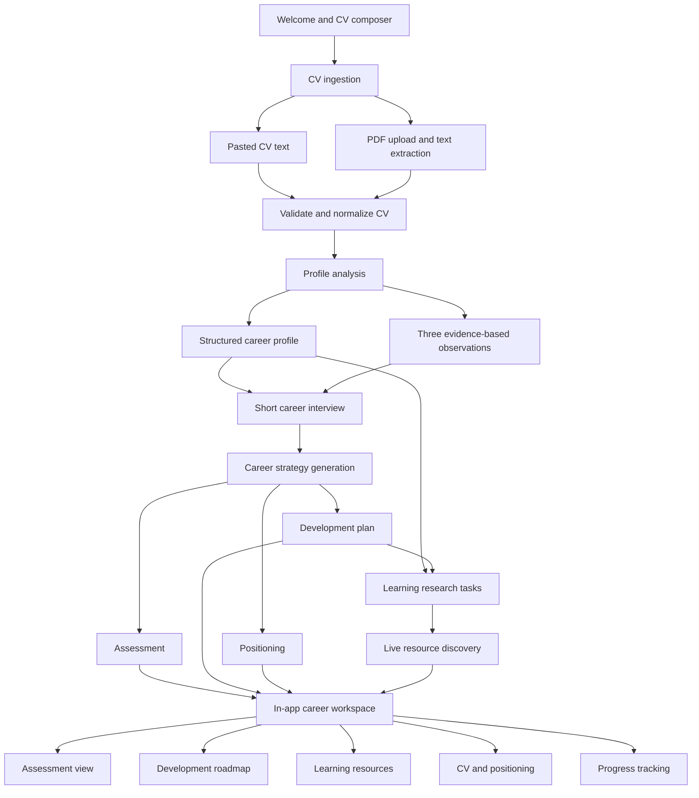
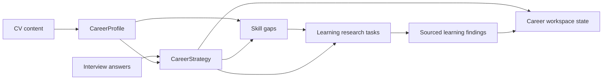

# AI Career Navigator

## Product Architecture

### Product outcome

AI Career Navigator turns a CV and a short interview into an evidence-based career
development workspace. The user should leave with:

1. A clear assessment of how AI may change their current work.
2. A development direction that fits their ambition, time, and budget.
3. A concrete plan containing skills, learning resources, projects, and milestones.
4. A workspace they can use inside the app instead of a document they must manage
   elsewhere.

The application is English-first. All interface labels, model instructions, model
outputs, validation messages, and generated content must be in English.

## Experience flow



## Main product areas

### 1. Welcome and CV composer

The first screen contains:

- A concise welcome message.
- One chat-style text composer for pasted CV content.
- A compact PDF upload button beside the composer.
- One send action.
- A clear privacy note.

The composer may expand to a modest maximum height, but it must not become a large
form or upload panel.

### 2. Career profile

The profile analysis converts CV content into a stable internal schema. It records:

- Current role, seniority, industry, and years of experience.
- Employment history and evidence-backed task clusters.
- Skills, education, languages, and existing AI-tool signals.
- Strong career assets.
- Tasks that may face change pressure.
- Potential development directions.
- Missing or uncertain information.

Every important generated claim should reference evidence from this profile.

### 3. Career interview

The interview remains short and fixed:

- Development ambition: optimize, evolve, or reinvent.
- Weekly time available.
- Learning budget.
- The reason the user is seeking guidance now.

The answers are constraints, not decorative context. They must visibly change the
depth, pace, resources, and target direction of the development plan.

### 4. Career assessment

The assessment is one product area within the workspace. It contains:

- AI change pressure by real task.
- The reasoning and CV evidence behind each assessment.
- Defensible strengths and transferable assets.
- Three prioritized development gaps.
- A concise strategic direction.

It is rendered as native interface sections, status indicators, and expandable
details. It is not rendered from Markdown.

### 5. Development roadmap

The roadmap is the main forward-looking area of the product:

- A 100-day plan divided into practical phases.
- A 12-month trajectory with quarterly outcomes.
- Two explicit decision gates.
- A tangible artifact or proof of progress for each phase.
- Tasks that can be marked as planned, active, or complete.

For the prototype, progress exists in the current Gradio session. Persisted progress
is a later feature requiring a deliberate storage and privacy decision.

### 6. Learning resources

Learning resources replace recent market signals.

The product must not rely on a static course catalog. There are too many viable
courses, videos, repositories, communities, books, events, and practice paths to
capture manually. The model may propose search intents and learning actions, but
concrete named resources and URLs should come from a research layer.

Research should cover:

- Courses and workshops.
- YouTube lectures and full-course playlists.
- GitHub repositories, templates, and examples.
- Books and practitioner guides.
- Events, meetups, conferences, and webinars.
- Communities, newsletters, podcasts, and people to interview.
- Side projects and on-the-job experiments.

The learning area should show:

- Why the resource or action matches the user.
- Which gap it addresses.
- Time, cost, and format where available.
- Source link for live results.
- A save-to-plan action.
- A clear queued search phrase when live search is not configured.

### 7. Positioning

The positioning area turns the strategy into usable career assets:

- Revised CV bullets based on real experience.
- A suggested LinkedIn headline.
- A short professional narrative.
- Optional portfolio-project suggestions.

These remain editable or copyable inside the app.

### 8. Development workspace

After generation, the user stays in one application workspace with navigation
between:

- Overview
- Assessment
- Roadmap
- Learning
- Positioning

The right sidebar may show profile, plan progress, saved learning resources, companies, and
relevant jobs. Companies and jobs are optional enrichment; they must not block the
core workflow.

## Data architecture



The primary internal objects are:

- `CareerProfile`
- `InterviewAnswers`
- `CareerAssessment`
- `DevelopmentPlan`
- `PositioningAssets`
- `LearningResearchTask`
- `LearningFinding`
- `WorkspaceState`

Structured JSON is the interchange format between model calls and application code.
It is not the presentation format.

## Rendering and export

Markdown should no longer be the main report technology.

The application should render structured data through native UI components:

- Task assessment rows with status indicators.
- Gap cards with evidence and priority.
- Roadmap phases with checkable actions.
- Learning-resource rows with metadata and save actions.
- Editable positioning fields.

The initial export options should be:

1. A print-friendly in-app report view using HTML and CSS.
2. Browser print-to-PDF.
3. Structured JSON export for testing and debugging, hidden from ordinary users.

A server-generated PDF can be added later if user testing shows that a downloadable
artifact matters. Markdown export is unnecessary for the primary experience.

## Service boundaries

The target code structure is:

```text
app.py                    Application entry point and event wiring
config.py                 Environment and provider configuration
models.py                 Typed application schemas
cv.py                     CV validation and PDF text extraction
llm.py                    Provider-independent model interface
providers/
  openai_compatible.py    OpenRouter and compatible APIs
  anthropic.py            Anthropic API
prompts/
  profile.py              Profile extraction prompt
  strategy.py             Career strategy prompt
discovery.py              Optional companies, jobs, learning resources, people, and events
workspace.py              State transitions and validation
ui/
  layout.py               Gradio application structure
  renderers.py            Structured UI rendering
  styles.css              Responsive styles
tests/
  fixtures/               Synthetic and anonymized CV inputs
  test_schemas.py
  test_courses.py
  test_workflow.py
```

The split should be introduced incrementally after the current uncommitted
`app.py` work is synchronized.

## Reliability principles

- The career workflow works without live job, company, or search APIs.
- Live enrichment is loaded separately and never delays the assessment.
- Model output is validated against typed schemas.
- One controlled repair attempt is allowed for invalid structured output.
- Named resources and URLs come only from live research results or user-provided sources.
- Budget and time constraints are enforced in application code.
- CV claims must include evidence or be labeled as uncertain.
- Provider-specific behavior remains behind the model interface.
- No secret keys, CVs, or personal reports are committed to the repository.

## Product trajectory

### Prototype

- English end-to-end workflow.
- CV analysis and fixed interview.
- Structured in-app assessment and roadmap.
- Dynamic learning-resource search tasks.
- Session-based progress.
- Optional companies and jobs.

### User-test release

- Evaluation across representative CV types.
- Improved evidence grounding and prompt sensitivity.
- Learning-resource save-to-plan workflow.
- Responsive and accessible interface.
- Print-friendly report view.

### Later product

- Explicit opt-in persistence.
- User accounts and cross-session progress.
- Deeper research tasks with source freshness and relevance scoring.
- Re-analysis after completing milestones.
- Comparison between original and updated CV.
- Feedback and outcome measurement.
